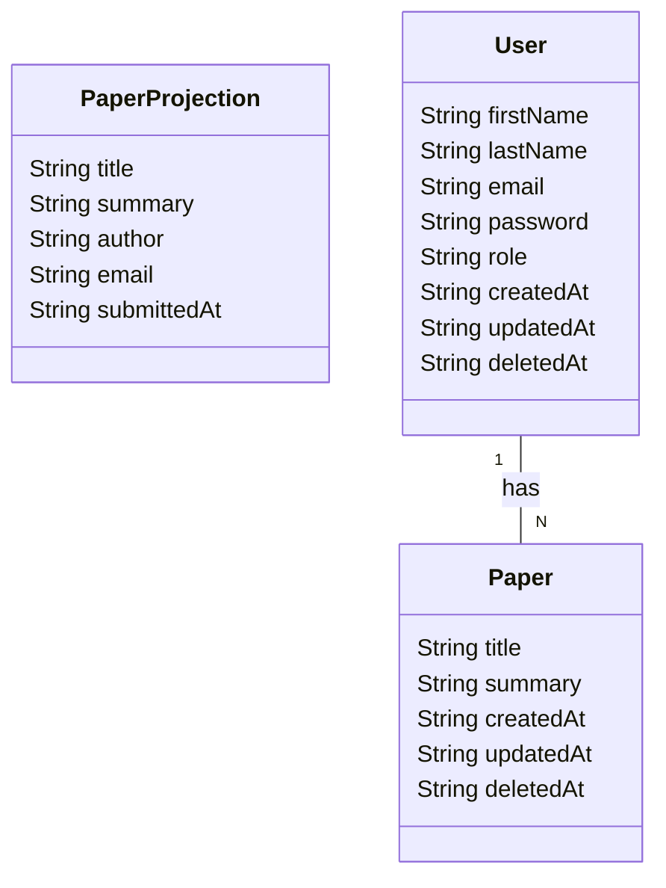
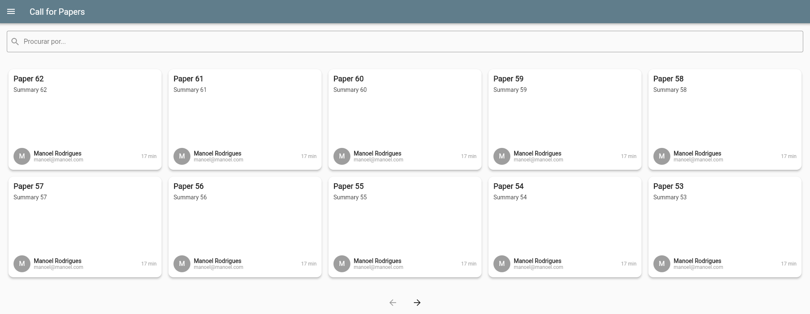
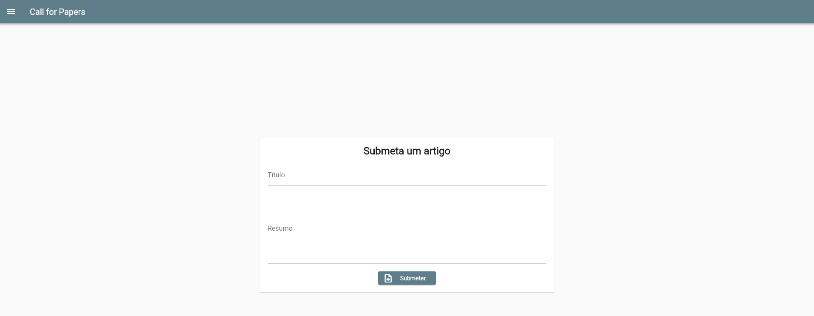
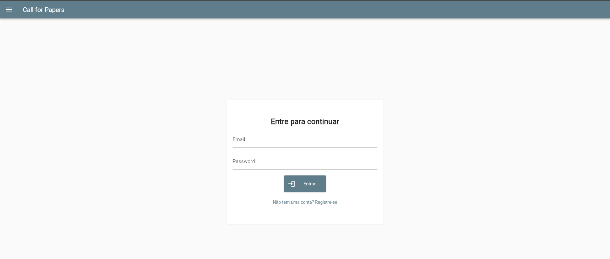
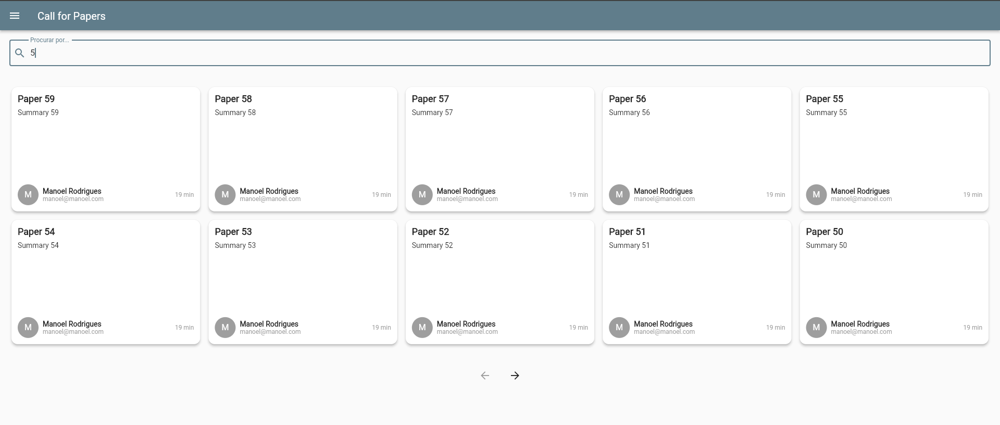
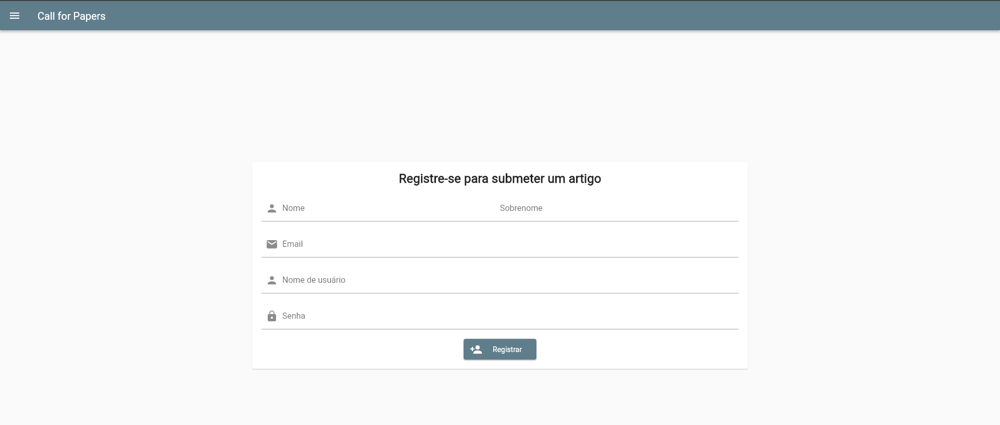

# Call for Papers

Tecnologias usadas:

- Quarkus
- Postgres
- Docker
- Flutter (Frontend)

## Rodando o projeto

Antes de rodar o projeto, você deve ter o Docker e o Docker Compose instalados na sua máquina. Para mais informações,
acesse a [documentação oficial](https://docs.docker.com/get-docker/).

1. Clone este repositorio

```bash
git clone https://github.com/manoelpiovesan/cfp-back.git
```

⚠️ Nota: O backend está configurado para lidar com autenticação via JWT, então você precisa configurar as chaves
públicas e
privadas para que o backend possa assinar e verificar os tokens. Para isso, você deve seguir os passos presentes no
repositório:
[manoelpiovesan/quarkus-jwt](https://github.com/manoelpiovesan/quarkus-jwt)

2. Dentro do repositório, faça o build do backend Quarkus

```bash
./gradlew clean build
```

Para facilitar o processo de execução do projeto, o frontend, criado em Flutter, foi pré-buildado e está presente no
diretório `frontend`.
Você pode ver o código fonte do frontend em [manoelpiovesan/cfp-front](https://github.com/manoelpiovesan/cfp-front)

3. Agora suba a stack do projeto com o docker compose

```bash
docker compose up
```

Tudo pronto! Agora você pode acessar a documentação da API (Swagger)
em [http://localhost:8080/api/swagger-ui/](http://localhost:8080/q/swagger-ui/)
e o frontend em [http://localhost:8081](http://localhost:8081).

## Diagrama de Entidade-Relacionamento do Banco de Dados



## Capturas de Tela

Lista de Papers


Tela de Submissão


Tela de Login


Busca por Papers (com filtro)


Registro de Usuário


## Exemplo de submissão

[Vídeo de exemplo](https://youtu.be/UWyIPV5Uk1k)

